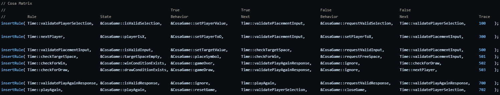
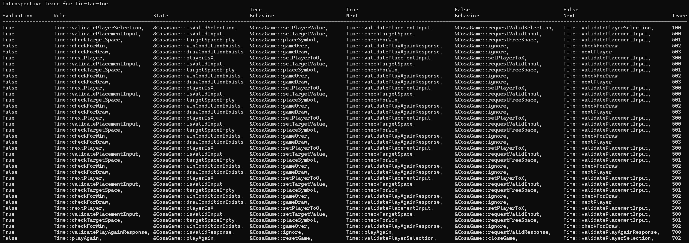
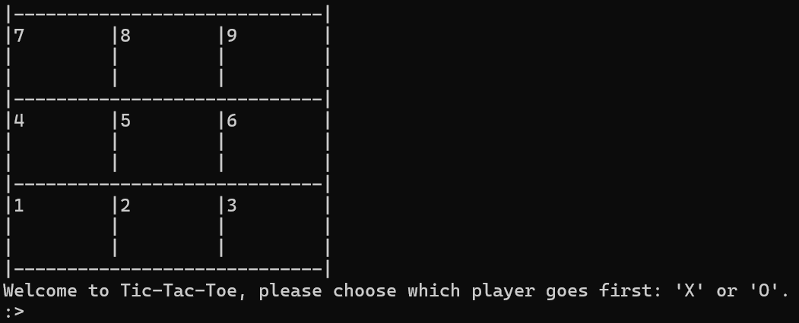

# Cosa-Tac-Toe

Simple console tic-tac-toe game. My first attempt at a COSA implementation.

## Coherent Object System Architecture (COSA)

For a deeper explanation of COSA, please see the creator's pdf presentation [here](https://apps.dtic.mil/sti/pdfs/ADA558344.pdf), or check out his first book on the subject [Breaking the Time Barrier](https://www.amazon.com/dp/B0045JK5IE?ref_=cm_sw_r_kb_dp_2EFKXBP71J7ZVBG2FSQZ).

From a high-level perspective, COSA has a table of functions arranged in such a way that when indexing into the function table with the `Time` component, a function that returns a boolean is called.  The result of said call (true or false) triggers the appropriate procedure that modifies the state of the COSA engine.  In the screenshot below taken from the source code, the time component or `Rule` sets the index for the `State` functions, which return a boolean.  The `behaviors` that will be triggered if the result is `true` or `false`, and then the `Next` time index that will be called following the behavior.  Finally, a `Trace` id is added to track the flow through the program when trace logging is enabled.

Here's a screenshot of the trace file produced by a short game.  From the start of the trace, the first rule is `Time::validatePlayerSelection`, which calls the `CosaGame:isValidSelection` function.  This function call evaluates to `True`, as a result we call the `True Behavior` - `CosaGame::setPlayerValue`, and then we set the time index from the `True Next` column to `Time::validatePlacementInput`.  Then flow continues down the trace from top to bottom, it's actually very simple once you wrap your head around it.

## Building and Playing

- Clone the repo.
- Call `cmake -B build` and `cmake --build build` to create and configure a build directory and build the project.
- Run `CosaTacToe` in the build directory.
- Game squares are selected with 1-9.

